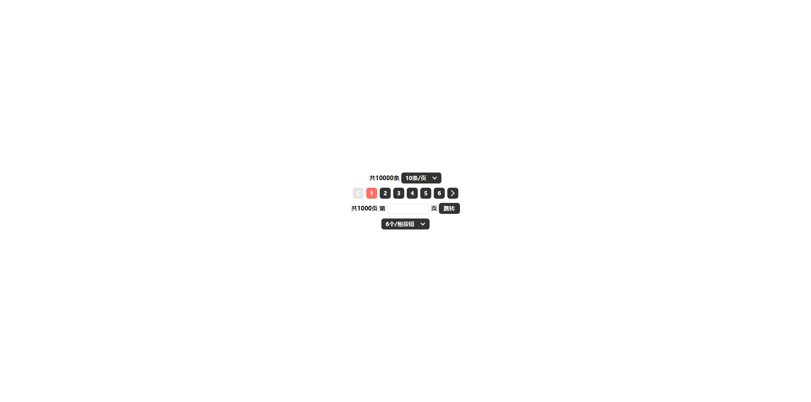
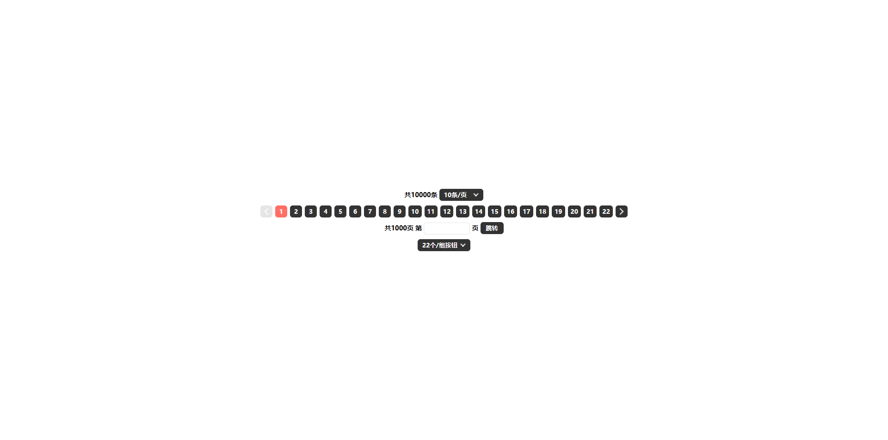

## 分页
由默开发，可设置数据显示几条/页，可设置按钮显示几个/组按钮。
### 项目目录
分页
 
├── css
 
│&emsp;&nbsp;&nbsp;└── style.css
 
├── js
 
│&emsp;&nbsp;&nbsp;└── js.js
 
├── index.html
### 基于以下技术
HTML5：用于页面布局
 
CSS3：用于页面美化
 
JavaScript：用于页面事件

## 预览
### 默认状态

### 最小状态

### 最大状态
